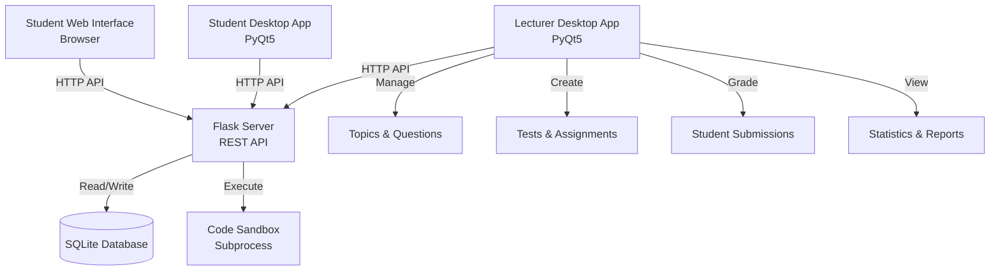

# Educational Assessment System - Implementation Plan

## Architecture Overview

The system will use a **client-server architecture**:

- **Lecturer Interface**: PyQt5 desktop application for test creation, grading, and analytics
- **Student Interfaces**: 
  - Web-based interface (Flask templates) accessible via browser
  - Desktop application (PyQt5) for students who prefer native app
- **Backend**: Flask REST API server that all interfaces connect to
- **Database**: SQLite for data persistence
- **Code Execution**: Isolated Python subprocess for safe code evaluation

Both student interfaces connect to the same API, providing flexibility for different access preferences and network conditions.

### Benefits of Dual Student Interface Approach

- **Web Interface**: 
  - No installation required - works on any device with a browser
  - Easy access from shared computers in common areas
  - Cross-platform compatibility (Windows, Mac, Linux, tablets)
  - Quick access for students who just need to take a test

- **Desktop Application**:
  - Better performance for complex questions (code editing, diagram drawing)
  - Offline capability - can cache questions and submit when connection is restored
  - Native look and feel
  - Better integration with system (notifications, file system)
  - Preferred by students who take multiple tests regularly

- **Shared API**: Both interfaces use the same REST API endpoints, ensuring consistency and reducing maintenance overhead.



## Technology Stack

- **Lecturer GUI**: PyQt5 (modern, feature-rich desktop framework)
- **Backend Server**: Flask (lightweight, Python-native)
- **Database**: SQLite (single-file, easy backup/portability)
- **Student Web Interface**: Flask templates with Bootstrap (responsive web UI)
- **Student Desktop App**: PyQt5 (native desktop experience, offline-capable)
- **Code Execution**: Python subprocess with resource limits
- **Drawing Tool**: 
  - Web: HTML5 Canvas for diagram questions
  - Desktop: QPainter/QGraphicsView for native drawing
- **Charts**: Chart.js or Plotly for statistics visualization
- **PDF Export**: ReportLab or WeasyPrint
- **CSV Export**: Built-in Python csv module

## Database Schema

### Core Tables

- `users` - Students and lecturers (id, username, password_hash, role, student_id)
- `topics` - Course topics (id, name, description, created_at)
- `questions` - Question bank (id, topic_id, type, content, correct_answer, test_cases, points)
- `tests` - Test definitions (id, name, description, time_limit, attempts_allowed, created_at)
- `test_questions` - Many-to-many: tests ↔ questions (test_id, question_id, order, points)
- `submissions` - Student test submissions (id, test_id, user_id, started_at, submitted_at, status)
- `answers` - Individual question answers (id, submission_id, question_id, answer_text, code, diagram_data, score, feedback)
- `grades` - Final grades (submission_id, total_score, max_score, percentage, graded_by, graded_at)

## File Structure

```
EU/
├── lecturer_app/              # PyQt5 desktop application for lecturers
│   ├── main.py               # Entry point
│   ├── windows/
│   │   ├── main_window.py    # Main dashboard
│   │   ├── test_editor.py    # Test creation/editing
│   │   ├── question_bank.py  # Question management
│   │   ├── grading_window.py # Grading interface
│   │   ├── statistics.py     # Analytics dashboard
│   │   └── student_management.py
│   ├── widgets/              # Reusable UI components
│   │   ├── question_editor.py
│   │   ├── code_editor.py
│   │   └── chart_widget.py
│   └── api_client.py         # HTTP client for API
├── student_app/              # PyQt5 desktop application for students
│   ├── main.py               # Entry point
│   ├── windows/
│   │   ├── login_window.py   # Student login
│   │   ├── dashboard.py      # Test list and status
│   │   ├── test_taking.py    # Test taking interface
│   │   └── results_view.py   # View results and feedback
│   ├── widgets/              # Reusable UI components
│   │   ├── question_widget.py
│   │   ├── code_editor.py    # Syntax-highlighted code editor
│   │   ├── diagram_canvas.py # Drawing canvas for diagrams
│   │   └── timer_widget.py   # Test timer display
│   └── api_client.py         # HTTP client for API
├── server/                   # Flask backend server
│   ├── app.py               # Flask application
│   ├── models.py            # Database models (SQLAlchemy)
│   ├── routes/
│   │   ├── auth.py          # Authentication endpoints
│   │   ├── tests.py         # Test management
│   │   ├── questions.py     # Question management
│   │   ├── submissions.py   # Submission handling
│   │   ├── grading.py       # Grading endpoints
│   │   └── statistics.py    # Analytics endpoints
│   ├── services/
│   │   ├── code_executor.py # Safe code execution
│   │   ├── grader.py        # Auto-grading logic
│   │   └── report_generator.py
│   └── templates/           # Student web interface
│       ├── login.html
│       ├── dashboard.html
│       ├── test_taking.html
│       ├── drawing_canvas.html
│       └── results.html
├── shared/                   # Shared code between apps
│   ├── api_client.py        # Common API client base class
│   └── constants.py         # Shared constants and config
├── database/
│   └── init_db.py          # Database initialization
├── requirements.txt        # Python dependencies
└── README.md              # Setup and usage instructions
```

## Key Features Implementation

### 1. Question Types

- **Multiple Choice**: Radio buttons or checkboxes (single/multiple select)
- **Code Questions**: Syntax-highlighted code editor (CodeMirror) with auto-test capability
- **Diagram Questions**: HTML5 Canvas with drawing tools (pen, shapes, text)
- **Long Text**: Rich text editor for essay-style answers

### 2. Test Creation & Management

- Drag-and-drop question selection from question bank
- Topic filtering and search
- Question point allocation
- Test configuration (time limits, attempts, availability dates)
- Question randomization option

### 3. Code Execution & Auto-Grading

- Safe subprocess execution with timeout and resource limits
- Test case validation (input/output matching)
- Syntax error detection
- Partial credit for passing some test cases

### 4. Grading Interface

- Side-by-side view: question + student answer
- Code execution results display
- Diagram viewer with annotation tools
- Rubric-based scoring
- Bulk grading shortcuts
- Save draft grades

### 5. Statistics & Analytics

- Topic-wise performance heatmap
- Individual student progress tracking
- Class-wide statistics (average scores, common mistakes)
- Question difficulty analysis
- Export to PDF/CSV

### 6. Student Interfaces (Web & Desktop)

**Web Interface:**

- Clean, responsive web UI accessible via browser
- Test list with status (not started, in progress, completed)
- Question navigation with progress indicator
- Auto-save answers
- Timer display for timed tests
- Submission confirmation
- HTML5 Canvas for diagram drawing

**Desktop Application:**

- Native PyQt5 interface with same functionality
- Offline capability (cache questions, submit when online)
- Native code editor with syntax highlighting
- QPainter-based drawing canvas for diagrams
- System tray integration for background operation
- Better performance for complex questions

## Security Considerations

- Password hashing (bcrypt)
- SQL injection prevention (SQLAlchemy ORM)
- Code execution sandboxing (subprocess with resource limits)
- Input validation and sanitization
- Session management for web interface
- CORS configuration for local network access

## Implementation Phases

### Phase 1: Core Infrastructure

1. Set up Flask server with basic routes
2. Create SQLite database schema
3. Implement authentication system
4. Create basic PyQt5 lecturer window structure

### Phase 2: Question & Test Management

1. Question bank interface (CRUD operations)
2. Test creation and editing
3. Question type editors (multiple choice, code, text, diagram)
4. Topic management

### Phase 3: Student Interfaces

**Web Interface:**

1. Web login and dashboard
2. Test taking interface
3. HTML5 Canvas drawing tool for diagrams
4. Code editor integration (CodeMirror)
5. Answer submission

**Desktop Application:**

1. PyQt5 login window
2. Dashboard with test list
3. Test taking interface with all question types
4. Native drawing canvas (QPainter/QGraphicsView)
5. Syntax-highlighted code editor (QScintilla)
6. Offline mode with answer caching
7. Answer submission and sync

### Phase 4: Grading System

1. Submission viewing interface
2. Code auto-grading with test cases
3. Manual grading tools
4. Feedback system
5. Grade calculation and storage

### Phase 5: Statistics & Reporting

1. Analytics dashboard
2. Chart generation (topic performance, student progress)
3. PDF report generation
4. CSV export functionality

### Phase 6: Polish & Features

1. Student management (manual + CSV import)
2. Test configuration options
3. Auto-save functionality
4. UI/UX improvements
5. Error handling and validation

## Dependencies

```
# Backend
Flask==3.0.0
Flask-CORS==4.0.0
SQLAlchemy==2.0.23
bcrypt==4.1.1
python-dotenv==1.0.0

# Desktop Applications (Lecturer & Student)
PyQt5==5.15.10
QScintilla==2.13.3  # Code editor for desktop apps
requests==2.31.0

# Code Execution
psutil==5.9.6  # Resource monitoring

# Reporting
reportlab==4.0.7  # PDF generation
pandas==2.1.4  # Data manipulation for CSV

# Web Interface
Jinja2==3.1.2  # Template engine (comes with Flask)
```

## Configuration

- Server port configuration (default: 5000)
- Database path
- Code execution timeout and memory limits
- Session timeout
- File upload size limits

## Future Enhancements (Out of Scope for MVP)

- Question templates and question pools
- Peer review functionality
- Integration with LMS systems
- Mobile-responsive student interface
- Real-time notifications
- Collaborative question creation